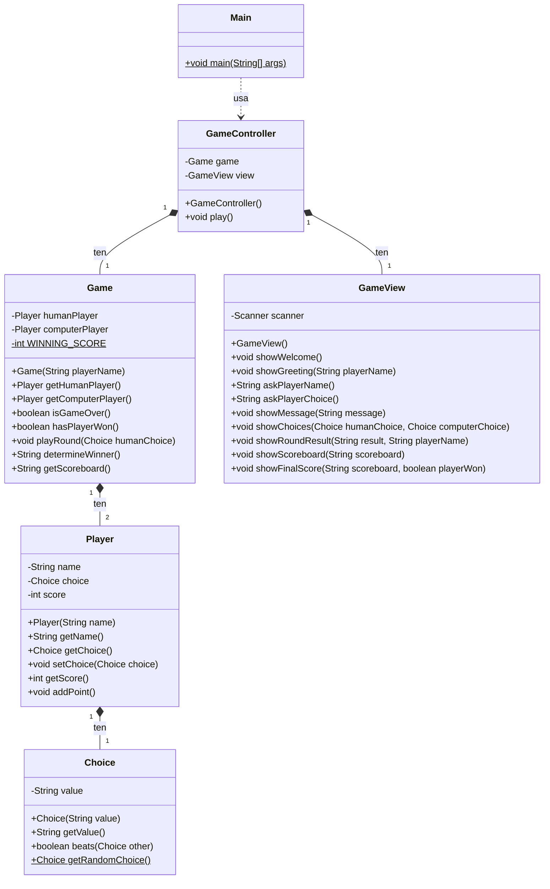

# Práctica: Xogo Pedra-Papel-Tesoiras

## Introdución

Nesta práctica imos implementar un xogo de **Pedra-Papel-Tesoiras** aplicando o patrón de deseño **MVC (Modelo-Vista-Controlador)** e os principios da **Programación Orientada a Obxectos**.

O xogador competirá contra o computador, que elixirá de forma aleatoria. O xogo levará un marcador de puntuación e **a partida rematará cando un dos dous xogadores chegue a 3 puntos**.

## Diagrama de clases



## Estrutura MVC

| Compoñente | Clases | Responsabilidade |
|------------|--------|------------------|
| **Modelo** | `Choice`, `Player`, `Game` | Lóxica do xogo e datos |
| **Vista** | `GameView` | Interacción co usuario (entrada/saída) |
| **Controlador** | `GameController` | Coordina o modelo e a vista |

---

## Paso 1: Clase `Choice` (Modelo)

Esta clase representa unha elección no xogo (ROCK, PAPER ou SCISSORS).

### Atributos
- `value` (String): Almacena o valor da elección ("ROCK", "PAPER" ou "SCISSORS")

### Construtor
- `Choice(String value)`: Inicializa o atributo `value` co parámetro recibido

### Métodos

#### `getValue()`
- **Retorna**: O valor da elección (String)

#### `beats(Choice other)`
Determina se esta elección gana a outra elección.

**Regras:**
- ROCK gana a SCISSORS
- PAPER gana a ROCK  
- SCISSORS gana a PAPER

- **Parámetro**: `other` - A outra elección contra a que comparar
- **Retorna**: `true` se esta elección gana, `false` en caso contrario

#### `getRandomChoice()` (método estático)
Crea unha elección aleatoria usando a clase `Random`.

- **Retorna**: Un novo obxecto `Choice` cun valor aleatorio

**Pista**: Usa `Random` e `nextInt(3)` para xerar un número entre 0 e 2.

---

## Paso 2: Clase `Player` (Modelo)

Esta clase representa un xogador no xogo.

### Atributos
- `name` (String): Nome do xogador
- `choice` (Choice): Elección actual do xogador
- `score` (int): Puntuación acumulada

### Construtor
- `Player(String name)`: Inicializa o nome e pon a puntuación a 0

### Métodos

#### `getName()`
- **Retorna**: O nome do xogador

#### `getChoice()`
- **Retorna**: A elección actual do xogador

#### `setChoice(Choice choice)`
- **Parámetro**: A nova elección do xogador

#### `getScore()`
- **Retorna**: A puntuación actual

#### `addPoint()`
Incrementa a puntuación en 1.

---

## Paso 3: Clase `Game` (Modelo)

Esta clase contén a lóxica principal do xogo.

### Constantes
- `WINNING_SCORE` (int, static final): Puntuación necesaria para gañar (valor: 3)

### Atributos
- `humanPlayer` (Player): O xogador humano
- `computerPlayer` (Player): O computador

### Construtor
- `Game(String playerName)`: Crea os dous xogadores. O xogador humano co nome recibido e o computador co nome "Computer"

### Métodos

#### `getHumanPlayer()`
- **Retorna**: O xogador humano

#### `getComputerPlayer()`
- **Retorna**: O xogador computador

#### `isGameOver()`
Comproba se a partida rematou (algún xogador chegou á puntuación necesaria para gañar).
- **Retorna**: `true` se algún xogador ten 3 ou máis puntos, `false` en caso contrario

#### `hasPlayerWon()`
Comproba se o xogador humano ganou a partida.
- **Retorna**: `true` se o xogador humano ten 3 ou máis puntos, `false` en caso contrario

#### `playRound(Choice humanChoice)`
Xoga unha rolda: establece a elección do humano e xera unha elección aleatoria para o computador.

- **Parámetro**: A elección feita polo xogador humano

#### `determineWinner()`
Determina o gañador da rolda e actualiza as puntuacións.

- **Retorna**: 
  - `"tie"` se hai empate
  - `"player"` se gana o xogador humano
  - `"computer"` se gana o computador

#### `getScoreboard()`
- **Retorna**: Unha cadea co marcador actual (ex: "Xan: 2 - Computer: 1")

---

## Paso 4: Clase `GameView` (Vista)

Esta clase xestiona toda a interacción co usuario por consola.

### Constantes (opcional, para mellorar a presentación)

#### Códigos de cor ANSI
```java
private static final String RESET = "\u001B[0m";
private static final String RED = "\u001B[31m";
private static final String GREEN = "\u001B[32m";
private static final String YELLOW = "\u001B[33m";
private static final String BLUE = "\u001B[34m";
private static final String CYAN = "\u001B[36m";
```

#### Emojis
```java
private static final String ROCK_EMOJI = "\u270A";      // ✊
private static final String PAPER_EMOJI = "\u270B";     // ✋
private static final String SCISSORS_EMOJI = "\u2702";  // ✂
```

### Atributos
- `scanner` (Scanner): Para ler a entrada do usuario

### Construtor
- `GameView()`: Inicializa o Scanner

### Métodos

#### `showWelcome()`
Mostra a mensaxe de benvida e as regras do xogo.

#### `showGreeting(String playerName)`
Saúda ao xogador polo seu nome.
- **Parámetro**: `playerName` - O nome do xogador

#### `askPlayerName()`
Pide o nome ao xogador.
- **Retorna**: O nome introducido (String)

#### `askPlayerChoice()`
Mostra o menú de opcións e pide ao xogador que elixa.

```
Choose your option:
1. Rock ✊
2. Paper ✋
3. Scissors ✂
Enter 1, 2, or 3:
```

- **Retorna**: A opción seleccionada como String ("ROCK", "PAPER" ou "SCISSORS")

#### `showMessage(String message)`
Mostra unha mensaxe por pantalla.

#### `showChoices(Choice humanChoice, Choice computerChoice)`
Mostra as eleccións de ambos xogadores.

#### `showRoundResult(String result, String playerName)`
Mostra o resultado da rolda segundo o código recibido:
- `"tie"` → "It's a tie!"
- `"player"` → "[nome] wins this round!"
- `"computer"` → "Computer wins this round!"

#### `showScoreboard(String scoreboard)`
Mostra o marcador actual.

#### `showFinalScore(String scoreboard, boolean playerWon)`
Mostra a puntuación final ao rematar o xogo.
- **Parámetros**:
  - `scoreboard`: A cadea co marcador final
  - `playerWon`: `true` se ganou o xogador humano, `false` se ganou o computador

---

## Paso 5: Clase `GameController` (Controlador)

Esta clase orquestra o fluxo do xogo, coordinando o modelo e a vista.

### Atributos
- `game` (Game): O modelo do xogo
- `view` (GameView): A vista

### Construtor
- `GameController()`: Inicializa a vista

### Métodos

#### `play()`
Método principal que executa o xogo:

1. Mostra a benvida (`showWelcome()`)
2. Pide o nome ao xogador
3. Crea o obxecto Game
4. Saúda ao xogador (`showGreeting()`)
5. Bucle `do-while` que continúa mentres `!game.isGameOver()`:
   - Pide a elección ao xogador (recibe String da vista)
   - Crea o obxecto Choice (o controlador crea obxectos do modelo)
   - Xoga a rolda
   - Mostra as eleccións
   - Determina e mostra o gañador da rolda
   - Mostra o marcador
6. Mostra a puntuación final e o gañador da partida

---

## Paso 6: Clase `Main`

Punto de entrada da aplicación.

```java
public class Main {
    public static void main(String[] args) {
        GameController controller = new GameController();
        controller.play();
    }
}
```

---

## Exemplo de execución

```
=== Welcome to Rock-Paper-Scissors! ===
First to 3 points wins!

Enter your name: Xan
Hello Xan! Let's play!

Choose your option:
1. Rock ✊
2. Paper ✋
3. Scissors ✂
Enter 1, 2, or 3: 1
You chose: ROCK
Computer chose: SCISSORS
Xan wins this round!
Scoreboard: Xan: 1 - Computer: 0

Choose your option:
1. Rock ✊
2. Paper ✋
3. Scissors ✂
Enter 1, 2, or 3: 2
You chose: PAPER
Computer chose: ROCK
Xan wins this round!
Scoreboard: Xan: 2 - Computer: 0

Choose your option:
1. Rock ✊
2. Paper ✋
3. Scissors ✂
Enter 1, 2, or 3: 3
You chose: SCISSORS
Computer chose: ROCK
Computer wins this round!
Scoreboard: Xan: 2 - Computer: 1

Choose your option:
1. Rock ✊
2. Paper ✋
3. Scissors ✂
Enter 1, 2, or 3: 1
You chose: ROCK
Computer chose: SCISSORS
Xan wins this round!
Scoreboard: Xan: 3 - Computer: 1

=== Final Score ===
Xan: 3 - Computer: 1
Congratulations! You won the game!
Thanks for playing!
```

---

## Notas importantes sobre MVC

1. **A Vista NON debe crear obxectos do Modelo**: `askPlayerChoice()` devolve un `String`, non un `Choice`. É o Controlador quen crea o obxecto `Choice`.

2. **O Modelo NON debe xerar mensaxes para o usuario**: `determineWinner()` devolve códigos simples ("tie", "player", "computer"), non mensaxes de texto. A Vista encárgase de xerar as mensaxes.

3. **O Controlador coordina**: Recibe datos da Vista, crea/manipula obxectos do Modelo, e pide á Vista que mostre os resultados.
