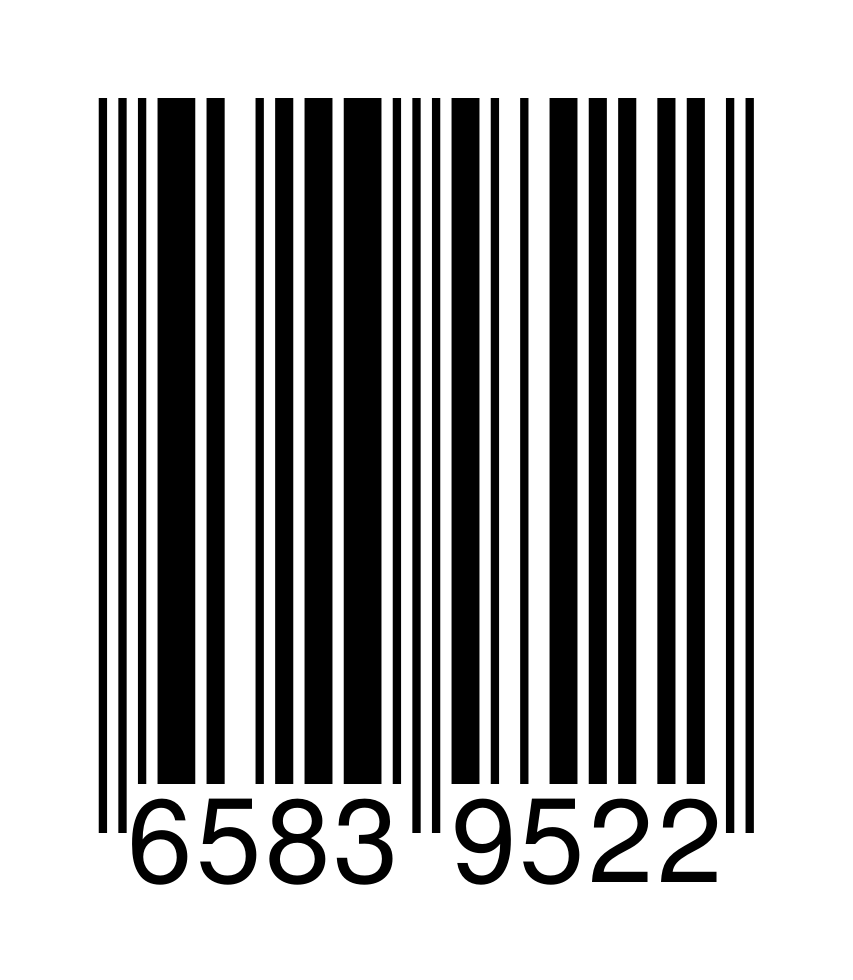

# Exercicios de Strings

## Exercicio 1: Operacións con cadeas

Crea unha clase chamada `OperacionsCadeas` que teña unicamente métodos estáticos e implemente os seguintes métodos sen empregar os métodos estándar de manipulación de cadeas:

1. **Carácter por liña:** Escribe cada carácter dunha cadea nunha liña diferente.
2. **Verificar prefixo:** Comproba se unha cadea comeza cunha subcadea dada.
3. **Contar caracteres:** Conta cantas veces aparece un carácter nunha cadea.
4. **Número de palabras:** Calcula o número de palabras nunha frase (separadas por un ou máis espazos).
5. **Iniciais en maiúsculas:** Devolve unha nova cadea igual á orixinal, pero coas iniciais de cada palabra en maiúsculas.
6. **Invertir cadea:** Devolve unha cadea coa orde dos caracteres invertida.
7. **Substituír caracteres:** Substitúe todas as aparicións dun carácter por outro.
8. **Maiúsculas/minúsculas:** Converte maiúsculas a minúsculas e viceversa.
9. **Buscar subcadea:** Verifica se unha cadea contén unha subcadea.
10. **Palíndromo:** Indica se unha cadea é un palíndromo (léese igual de esquerda a dereita e viceversa).
11. **Siglas dunha frase:** Devolve as siglas dunha frase en maiúsculas (primeira letra de cada palabra).

## Exercicio 2: Cifrado César

Un dos métodos máis antigos para codificar mensaxes é o coñecido como cifrado César. O seu funcionamento é simple: cada unha das letras da mensaxe orixinal é substituída por outra letra que se atopa un número fixo de posicións máis adiante no alfabeto.

Os desprazamentos tamén poden ser negativos; por exemplo, se utilizamos un desprazamento de -1, a 'E' converterase en 'D', mentres que a 'A' pasará a ser 'Z'.

O noso cifrado César non codifica os caracteres que non sexan letras anglosaxoas. Así, por exemplo, os espazos ou os símbolos de puntuación non sufrirán cambio algún.

1. Crea un programa en Java que pregunte ao usuario unha mensaxe sen cifrar e o desprazamento que quere empregar e devolva a mensaxe cifrada.

   Por exemplo, se o usuario introduce a mensaxe "ABC" e o desprazamento é 3, o programa devolverá "DEF".

2. Modifica o programa para que amose un menú no que o usuario poida escoller cifrado ou descifrado (estrutúrao empregando métodos).

Podes comprobar os teus resultados con axuda desta calculadora en liña:
<https://es.planetcalc.com/1434/>

## Exercicio 3 (<https://www.aceptaelreto.com/problem/statement.php?id=106&cat=16>)

O sistema EAN-8 codifica os códigos de barras en 8 números, dos cales os 7 primeiros constitúen o propio código e o último sería o código de control.

Para calcular o díxito de control (contando desde a dereita):

1. Os díxitos en posicións impares multiplícanse por 3.
2. Os díxitos en posicións pares multiplícanse por 1.
3. Súmanse os resultados e calcúlase o número necesario para chegar ao múltiplo de 10 máis próximo.

Por exemplo, para o código EAN-8 da figura a operación para realizar é:
$$2 · 3 + 5 · 1 + 9 · 3 + 3 · 1 + 8 · 3 + 5 · 1 + 6 · 3 = 88$$

O díxito de comprobación é o número que hai que sumar ao resultado anterior para chegar a un valor múltiplo de 10. No exemplo de EAN-8, para chegar ao múltiplo de 10 máis próximo por encima do número 88 hai que sumar 2 (e chegar ao 90). Ten en conta que se a suma resulta ser xa múltiplo de 10, o díxito de control será 0.

Realiza un programa que reciba un código EAN-8 sen o díxito de control e o calcule. Engade a posibilidade de comprobar o díxito de control dun código completo.

## Exercicio 4 (<https://www.aceptaelreto.com/problem/statement.php?id=117&cat=16>)

Crea un programa que ante un saúdo coa estrutura "Son \<nome\>" conteste "Ola, \<nome\>" mentres reciba liñas de texto diferentes a "Acabou a festa" (esta con calquera capitalización).

## Exercicio 5 (<https://www.aceptaelreto.com/problem/statement.php?id=110&cat=16>)

Implementa un programa que determine se dous versos riman ou non (considerando rima consoante, deben coincidir todas as letras a partires da última vogal acentuada).

Considera que as últimas palabras son graves, é dicir que o acento se atopa na penúltima vogal do verso e que esas últimas vogais non levan til.

Na primeira aproximación, considera que as letras que tés que comprobar son as 3 últimas de cada liña.

Unha vez que teñas conseguido isto, modifícao para que o programa procure a penúltima vogal e compare a partir dela.

## Exercicio 6: Expresións regulares

### Apartado a

Crea as seguintes expresións regulares e proporciona exemplos coincidentes e non coincidentes:

| Expresión Regular                      | Expresión regular | Exemplo Coincidente | Exemplo Non Coincidente |
|----------------------------------------|-------------------|---------------------|-------------------------|
| Tres letras maiúsculas                 ||||
| Número de 9 díxitos                    ||||
| Número, punto, e letra maiúscula/minúscula ||||
| Maiúscula inicial e minúsculas         ||||
| Non comeza por díxito                  ||||
| Entre 5 e 10 caracteres alfanuméricos  ||||
| Comeza por [DAW] seguido de tres números entre 4 e 7 ||||

### Apartado b

Crea unha aplicación que valide cadeas segundo as expresións regulares anteriores.

## Exercicio 7: Procura de palabras en negrita

As palabras en negrita en formato Markdown están rodeadas por dous asteriscos. Crea un programa que reciba unha cadea de texto e amose por pantalla as palabras en negrita. Debes empregar expresións regulares.

## Exercicio 8: Contas de usuario

Crea unha clase `Usuario` coas seguintes características:

### Atributos

- Nome
- Apelidos
- DNI. Debe comprobarse, mediante unha expresión regular, que ten o formato correcto (6 números seguidos dunha letra maiúscula) e que a letra é correcta, segundo o algoritmo oficial.
- Usuario do sistema
- Contrasinal
- Correo electrónico. Debe comprobarse, mediante unha expresión regular, que ten o formato correcto.
  
### Construtor

- Debe recibir o nome, os apelidos e o correo electrónico. Deberá crear o usuario do sistema (usando `crearUsuario()`) e o contrasinal de forma aleatoria co método `crearContrasinal()`.

### Métodos

- `calculaLetraDNI()`: Calcula a letra do DNI segundo o algoritmo oficial. Debe ser un método estático.
- `dniCorrecto()`: Comproba se o DNI é correcto.
- `correoCorrecto()`: Comproba se o correo electrónico é correcto.
- `crearUsuario()`: Crea un usuario do sistema co nome do usuario en minúsculas e as iniciais dos apelidos. Por exemplo, para un usuario con nome "Xiama" e apelidos "Pérez López", o usuario do sistema sería "xianapl".
- `crearContrasinal()`: Crea un contrasinal aleatorio de 8 caracteres alfanuméricos, coas seguintes condicións:
  - 12 caracteres
  - 3 letras maiúsculas
  - 2 símbolos entre os seguintes: `!@#$%&`
**PISTAS**: Emprega a clase `Random` para xerar números aleatorios, e a clase `StringBuilder` para xerar o contrasinal. Xera primeiro o contrasinal con 10 letras minúsculas, determina aleatoriamente cales 3 delas pasarán a maiúsculas, escolle 2 símbolor e colócaos en posicións aleatorias.
- `toString()`: Devolve unha cadea coa información do usuario.

## Exercicio 9: Vehículo

Crea unha clase `Vehiculo` coas seguintes características:

### Atributos

- Matrícula. Debe ser unha matrícula válida, con 4 números e 3 letras (segundo as normas actuais), emprega expresións regulares.
- Marca
- Modelo
- Cor
- Ano de fabricación. Debe comprobarse que é un ano válido (entre 1900 e o ano actual).
- Propietario. Será un obxecto da clase `Persoa`. Podes empregar a clase `Persoa` do exercicio anterior.
- Última matrícula, será un atributo estático que se incrementará cada vez que se cree un vehículo. Debes seguir as normas de matriculación actuais.

### Construtores

- Un deles debe recibir a marca, o modelo, a cor, o ano de fabricación e o propietario. A matrícula debe ser asignada automaticamente, a seguinte á última matrícula asignada.
- Otro debe recibir os valores de todos os atributos, incluída a matrícula.

### Métodos

- `matricular()`: Asigna unha matrícula ao vehículo. Debe modificar o atributo estático `últimaMatrícula` para que a seguinte matrícula sexa correcta.
- `toString()`: Devolve unha cadea coa información do vehículo.

**PISTAS**: Emprega a clase `LocalDate` para obter o ano actual.

## Exercicio 10: Operacións sobre `StringBuilder`

Implementa operacións sobre unha cadea convertida a `StringBuilder`:

1. Engadir `*` na posición 3.
2. Substituír o carácter da posición 1 por `#`.
3. Eliminar o carácter da posición 2.
4. Eliminar caracteres entre as posicións 5 e 8.
5. Inverter os caracteres.
6. Substituír caracteres en posicións pares por `$`.
7. Converter o resultado final a `String`.
