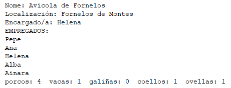

# Exercicios Completos de Exames

Para todos os exercicios:
- Crea un programa principal que sirva para probar as clases creadas e os seus métodos.
- Inclúe unicamente os getters e setters que sexan necesarios.
- Crea novas excepcións para controlar os erros que se produzan se se trata de introducir datos incorrectos nos construtores ou métodos.

## Exercicio 1 (Curso 22-23): Mundo Máxico de Harry Potter

Para adecuarse aos tempos, o Ministerio de Maxia británico quere xestionar o mundo máxico desenvolvendo unha aplicación de escritorio en Java empregando o paradigma de Programación Orientada a Obxectos. Tras un estudo previo, recibes o encargo de implementar:

### Enumerado Casa
Pode tomar os valores: `GRYFFINDOR`, `HUFFLEPUFF`, `RAVENCLAW` ou `SLYTHERIN`.

### Clase Persoa
- **Atributos:**
    - `nome`
    - `dataNacemento`
- **Construtor:**
    - Un construtor con todos os atributos.
- **Métodos:**
    - `abstract boolean eMaiorIdade()`: Devolve `true` ou `false` segundo sexa ou non maior de idade.
    - `protected int calcularIdade()`: Devolve a idade da persoa. Só accesible para clases fillas no mesmo paquete.
    - `public String toString()`: Representación textual da persoa.

### Clase Muggle
Herda de `Persoa` e representa unha persoa non máxica.
- **Atributos:**
    - `boolean creNaMaxia` (por defecto, `false`).
- **Construtores:**
    - Un construtor con parámetros `nome` e `dataNacemento`.
    - Un construtor con parámetros `nome`, `dataNacemento` e `creNaMaxia`.
- **Métodos:**
    - `boolean eMaiorIdade()`: Un muggle é maior de idade ao cumprir 18 anos.
    - `public String toString()`: Mostra toda a información, incluíndo a de `Persoa`.

### Clase Mago
Herda de `Persoa` e representa unha persoa máxica.
- **Atributos:**
    - `String tipoVasoira`
    - `Casa casa` (valor do tipo enumerado `Casa`, inicialmente `null`).
- **Métodos:**
    - `boolean eMaiorIdade()`: Un mago é maior de idade aos 17 anos.
    - `public String toString()`: Mostra toda a información, incluíndo a de `Persoa`.

### Interface Docente
Define os seguintes métodos:
- `void imponerDisciplina()`
- `void explicar()`

### Clase Profesor
Herda de `Mago` e implementa a interface `Docente`.
- **Atributos:**
    - Un array de frases icónicas de Harry Potter (por exemplo, “Non é bo deixarse arrastrar polos soños e esquecer vivir”, “A valentía sempre é a mellor opción”, etc.). Este array é común a todos os profesores e non pode ser modificado.
- **Métodos:**
    - `void imponerDisciplina()`: Utiliza o feitizo “Silencio Totalis”.
    - `void explicar()`: Escolle ao azar unha frase do array de frases.

### Clase Hogwarts
Representa o colexio de maxia.
- **Atributos:**
    - `ArrayList<Mago> alumnxs`: Lista dxs alumnxs que están actualmente no colexio.
    - `HashMap<String, Profesor> materias`: Relaciona as materias impartidas co profesor correspondente.
- **Métodos:**
    - `void engadirAlumnx(Mago mago)`: Asigna unha casa aleatoriamente ao mago e engádeo ao `ArrayList` de alumnxs.
    - `void graduar(Mago mago)`: Elimina ao mago do `ArrayList` porque xa rematou os seus estudos, pero mantén a casa á que pertence.
    - `void asignarProfesor(String materia, Profesor profesor)`: Engade ou modifica o profesor asignado a unha materia no `HashMap`.
    - `void listarProfesores()`: Lista os nomes dos profesores e as materias que imparten.
    - `ArrayList<Mago> alumnadoCasa(Casa casa)`: Devolve un `ArrayList` co alumnado pertencente á casa especificada.

## Exercicio 2 (Curso 23-24): Vehículos

Neste exercicio, implementarás un sistema básico de xestión para unha flota de vehículos nunha compañía de transporte.

### Enumerado TipoCombustible
Pode tomar os valores `JET_A1`, `AVGAS`, `GASOLINA`, `DIESEL`.

### Clase Vehiculo (Non Pode Instanciarse)
- **Atributos:**
    - `modelo`
    - `numeroDeSerie`
    - `tipoCombustible` (por defecto será `DIESEL`)
    - `cantidadCombustible` (por defecto será 0)
- **Construtores:**
    - Un construtor que reciba `modelo`, `numeroDeSerie` e `tipoCombustible`.
    - Un construtor que reciba `modelo` e `numeroDeSerie`.
- **Métodos Abstractos:**
    - `mantemento()`
- **Métodos Non Abstractos:**
    - `cargarCombustible()`: Mostra por pantalla o tipo de combustible que se está cargando.

### Interface Voador
- **Métodos:**
    - `despegar()`
    - `aterrar()`

### Interface TransportadorMercadorias
- **Métodos:**
    - `cargar()`
    - `descargar()`

### Clase Avion
Herda de `Vehiculo` e implementa `Voador`.
- **Atributos Adicionais:**
    - `consumo`
- **Métodos:**
    - `maximaDistanciaPercorrer()`: Devolve o número de km a percorrer tendo en conta a cantidade de combustible e o consumo do avión. Non pode ser sobrescrito en clases fillas.
    - Realiza o mantemento chamando ao mecánico para que acuda (amosa unha mensaxe por pantalla) e mostra mensaxes por pantalla ao aterrar e despegar.
- **Construtores:**
    - Os necesarios para inicializar todos os atributos, incluíndo os herdados.

### Clases que Herdan de Avion

#### Clase AvionComercial
- **Atributos Adicionais:**
    - `numeroPasaxeiros`
    - `tripulacion` (HashMap que relaciona o cargo co nome, inicialmente estará baleira)
- **Métodos:**
    - `asignarTripulacion(cargo, nome)`
- **Construtores:**
    - Os necesarios para inicializar todos os atributos, incluíndo os herdados.

#### Clase AvionCarga
Implementa `TransportadorMercadorias`.
- **Atributos Adicionais:**
    - `capacidadeCarga`
    - `cargaActual`
    - `comandante`
- **Métodos:**
    - A carga realízase toda dunha vez, sempre aproveitando ao máximo a súa capacidade de carga.
    - A descarga realízase toda dunha vez.
- **Construtores:**
    - Os necesarios para inicializar todos os atributos, incluíndo os herdados.

### Clase Camion
Implementa `TransportadorMercadorias`.
- **Atributos Adicionais:**
    - `capacidadCarga`
    - `cargaActual`
    - `unidadCarga` (constante)
    - `conductor`
- **Métodos:**
    - Realiza o mantemento levando o camión ao taller (mostra unha mensaxe por pantalla).
    - A carga realízase en unidades de carga, cada vez que se chama a `cargar` increméntase unha unidade de carga.
    - A descarga realízase en unidades de carga, cada vez que se chama a `descargar` descóntase unha unidade de carga.

### Clase CompaniaTransporte
- **Atributos:**
    - `nome`
    - `vehiculos` (ArrayList)
- **Métodos:**
    - `agregarVehiculo(vehiculo)`: Engade un vehículo á flota.
    - `eliminarVehiculo(numeroDeSerie)`: Elimina o vehículo co número de serie dado da súa flota.
    - `toString()`: Mostra os datos de todos os vehículos da súa flota.

## Exercicio 3 (Curso 23-24): Pezas

A principal compañía do fabricante de xoguetes de bloques de construción quere desenvolver unha aplicación en Java que lle permita xestionar as súas pezas e conxuntos de pezas (xoguetes). Crea esta aplicación empregando a seguinte estrutura:

### Enumerado Cor
Pode tomar os valores `VERMELLO`, `AZUL`, `VERDE`, `AMARELO`, `NEGRO`, `BRANCO`.

### Interface Conectable
- **Métodos:**
    - `conectar(Peza p)`: Recibe unha peza e devolve un booleano.
    - `retirarPeza(String numeroSerie)`: Recibe unha peza e devolve un booleano.

### Clase Peza
Non pode instanciarse, implementa `Conectable`.
- **Atributos:**
    - `cor` (de tipo o enumerado `Cor`).
    - `numeroDeSerie` (valor enteiro).
    - `ArrayList<Peza>`: Lista coas pezas conectadas. Nunca debe superar o número de conectores que ten.
- **Construtores:**
    - Un construtor que reciba a `cor` e o `numeroDeSerie`. O `ArrayList` de pezas inicialízase baleiro.
- **Métodos Abstractos:**
    - `getNumeroConectores()`: Devolve un enteiro.
- **Métodos Implementados:**
    - `boolean conectar(Peza p)`: Engade a peza ao `ArrayList` de pezas. Comproba que non haxa máis pezas que conectores. Devolve un booleano indicando se foi posible conectar.
    - `boolean retirarPeza(String numeroSerie)`: Elimina as pezas co número de serie indicado. Devolve `false` se non se atopou ningunha peza con ese número de serie, e `true` en caso contrario.

### Clase PezaBasica
Filla de `Peza`, pode instanciarse.
- **Atributos Adicionais:**
    - `alto` (valor enteiro).
    - `ancho` (valor enteiro).
    - `largo` (valor enteiro).
- **Métodos:**
    - Os necesarios para que a clase poida instanciarse. O número de conectores da peza será o resultado de multiplicar o `ancho` polo `largo`.
    - `boolean equals(Object o)`: Dúas pezas son iguais se coinciden os seus números de serie.
- **Construtores:**
    - Os necesarios para inicializar todos os atributos, incluíndo os herdados.

## Exercicio 4 (curso 21-22): Granxa

Neste exercicio terás que modelar unha granxa, para iso, deberás crear as seguintes clases e métodos (e establecer as relacións entre elas que consideres oportuno):

### Enumerado TipoAnimal
Pode tomar os valores: `porcos`, `vacas`, `galiñas`, `coellos` ou `ovellas`.

### Interface Gandeiro
- **Métodos:**
    - `alimentarAnimais()`
    - `limparCortes()`

### Clase Empregado
Non se poden crear obxectos directamente.
- **Atributos:**
    - `numEmpregado`: Un número enteiro co número de empregado. Este número deberá ser maior que 0.
    - `nome`: Unha cadea co nome do empregado.
    - `dataInicio`: A data na que comezou a traballar na granxa. Debe comprobarse que sexa anterior á data actual, se non o é poñerase no seu lugar a data de hoxe.
    - `salarioBase`: O salario base que cobra mensualmente. Non poderá ser menor que o SMI (1000€).
- **Construtor:**
    - Un construtor con todos os parámetros.
- **Métodos:**
    - `determinarSalarioReal()`: Devolverá o salario real mensual do empregado. O salario real será o salario base máis 30€ por cada trienio completo na granxa (3 anos completos desde que empezou a traballar na granxa). Podes empregar a clase `Period` e os seus métodos `between()` e `getYears()` para facer este cálculo.
    - Getters e setters.

### Clase PersoalServizos
Filla de `Empregado`.
- **Atributos:**
    - `posto`: Que será un carácter que poderá tomar os valores `R` (recepción) ou `C` (contabilidade). O seu valor por defecto será `R`.

### Clase CoidadorAnimais
Filla de `Empregado` e implementa `Gandeiro`.
- **Atributos:**
    - `tipoAnimalExperto`: Co tipo de animais nos que é experto este empregado. Debe utilizarse o enumerado `TipoAnimal` indicado anteriormente.
- **Métodos:**
    - O salario real dun coidador calcularase coma o dun empregado xenérico pero engadiráselle un extra de 10€ ao mes se é experto en porcos ou 5€ se é experto en vacas (os outros expertos non teñen un extra).
    - Implementará os métodos da interface `Gandeiro` de modo que amosen unha mensaxe por pantalla indicando a que tipo de animais se está alimentando ou limpando as cortes (este tipo de animais será o indicado polo seu `tipoAnimalExperto`).

### Clase Granxa
- **Atributos:**
    - `nome`: O nome da granxa.
    - `localización`: A vila na que está situada a granxa.
    - `encargado`: Obxecto de tipo `Empregado` que indica que empregado é o encargado da granxa.
    - `empregados`: É un `ArrayList` coas persoas que traballan na granxa.
    - `numAnimais`: É un array que almacena o número de animais que hai na granxa. Na posición 0 os porcos; na 1, as vacas; na 2, as galiñas; na 3, os coellos e na 4, as ovellas.
- **Construtores:**
    - Un que recibe o `nome`, `localización` e `encargado`. O `ArrayList` cos empregados inicialízase baleiro e o array co número de animais inicialízase a 0 en todas as súas posicións.
    - Outro que recibe todos os atributos.
- **Métodos:**
    - Getters para todos os atributos.
    - Setters para o `nome`, `localización` e `encargado`.
    - `engadirAnimal(TipoAnimal t)`: Engade un animal dese tipo, incrementando o seu número na posición do array `numAnimais` correspondente.
    - `engadirEmpregado(Empregado e)`: Recibe un empregado e o engade ao `ArrayList`.
    - `getNumeroAnimais()`: Devolve o número total de animais que hai na granxa.
    - `getNumeroEmpregados(boolean coidadores)`: Devolve o número de empregados da granxa. Se `coidadores` é `true`, devolve unicamente o número de coidadores de animais.
    - `toString()`: Amosará os datos da granxa da seguinte maneira:

